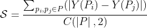
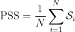

# ProSA: Assessing and Understanding the Prompt Sensitivity of LLMs

[](https://arxiv.org/abs/2410.12405)
[](./LICENSE)

## ☀️Introduction

We introduce **ProSA**, a framework designed to evaluate and comprehend prompt sensitivity in LLMs. ProSA incorporates a novel sensitivity metric, *PromptSensiScore* (PSS), and leverages decoding confidence to elucidate underlying mechanisms. Our extensive study, spanning multiple tasks, uncovers that prompt sensitivity fluctuates across datasets and models, with larger models exhibiting enhanced robustness. We observe that few-shot examples can alleviate this sensitivity issue, and subjective evaluations are also susceptible to prompt sensitivities, particularly in complex, reasoning-oriented tasks. Furthermore, our findings indicate that higher model confidence correlates with increased prompt robustness. We believe this work will serve as a helpful tool in studying prompt sensitivity of LLMs.

## 🌲 PSS

### Motivation

Previous work typically measures prompt sensitivity at the dataset level by calculating variances across different prompt templates. However, the differences in model performance under the same instances with different prompt templates are often overlooked. Each instance can vary widely in complexity, context, and information type, ranging from straightforward factual questions to those requiring nuanced understanding. This diversity means the model's sensitivity to prompts can differ significantly between instances. To analyze prompt sensitivity from the instance level, rather than dataset level perspective, we defined PSS to measure the sensitivity of LLMs to prompts.

### PSS

For each set of all prompt variants under the same instance, we have:



Here, $Y(p)$ represents the performance metric under this prompt $p$. For instances with the given ground truth, $Y(p)$ refers to the correctness of LLM' response. For tasks without explicit ground truth, where responses are often given a score representing the quality of the generation, $Y(p)$ refers to the given score within the interval [0, 1]. $\left | Y(P_i) - Y(P_j) \right |$ represents the absolute value difference in performance metrics between prompt $p_i$ and prompt $p_j$. $C(\left | P \right |, 2)$ represents the count of prompt pairs in the same instance. The calculation of PSS is as follows:



Here $N$ is the total number of instances in the dataset and $\mathcal{S}_i$ is the score for the $i$-th instance.

## 📒 Evaluation

### Setup

Our experiments are based on [OpenCompass](https://github.com/open-compass/opencompass), a highly reproducible and versatile LLM evaluation platform. All prompts used are available in `prompts` 

### Objective Evaluation

We evaluate multiple LLMs on four benchmarks include [CommonsenseQA](https://arxiv.org/abs/1811.00937), [ARC-Challenge](https://arxiv.org/abs/1803.05457), [MATH](https://arxiv.org/abs/2103.03874), and [HumanEval](https://arxiv.org/abs/2107.03374), with 12 prompt templates respectively.


We then explored the influence of few-shot examples on prompt sensitivity by evaluating Qwen1.5 series on ARC-Challenge and CommonsenseQA. We found larger models can exhibit better prompt robustness as the number of few-shot examples increases.


### Subjective Evaluation

We evaluate five advanced LLMs on [LC AlpacaEval 2.0](https://github.com/tatsu-lab/alpaca_eval) and [Arena Hard Auto](https://github.com/lmarena/arena-hard-auto) with three prompts respectively.

| **Benchmarks**        | **LC AlpacaEval 2.0** | **Arena Hard Auto** |
|-----------------------|-----------------------|---------------------|
| **Reference**         | 0.167                 | 0.275               |
| InternLM2-20B-Chat     | 0.022                 | 0.249               |
| Llama3-8B-Instruct    | 0.013                 | 0.266               |
| Llama3-70B-Instruct   | 0.016                 | 0.258               |
| Qwen1.5-14B-Chat      | 0.022                 | 0.249               |
| Qwen1.5-72B-Chat      | 0.036                 | 0.250               |

Here, **Reference** refers to the average quality difference of responses generated by Llama3-8b-Instruct and Llama3-70b-Instruct. The others represent the PSS of LLMs under the three prompt versions (One original and two generated).

Besides, we also re-clustered the prompts in Arena Hard Auto into 20 categories and ranked them with PSS, the top 5 and bottom 5 sensitive categories are shown as follows:


## 🖊️ Citation
If you find our work useful, please consider citing:
```
@article{zhuo2024prosa,
  title={ProSA: Assessing and Understanding the Prompt Sensitivity of LLMs},
  author={Zhuo, Jingming and Zhang, Songyang and Fang, Xinyu and Duan, Haodong and Lin, Dahua and Chen, Kai},
  journal={arXiv preprint arXiv:2410.12405},
  year={2024}
}
```